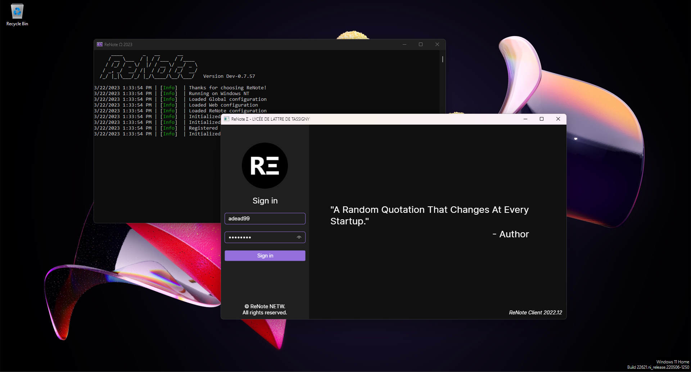

<h1 align="center">
  <b>ReNote</b>
  <br>
  <sub><sup><b>Goes<i> Beyond Limitations</i></b></sup></sub>
</h1>

<p align="center">
  ReNote brings you an easy-to-use timetable software, including all the tools you need to empower your productivity as a teacher or student.
  <br><br>
  
  <br><br>
</p>

# Build ReNote

You will at least need Visual Studio 2022 with .NET desktop development OR install .NET SDK 7.0 or higher directly.
If you use Visual Studio, you can go ahead and open the solution "ReNote.sln". Alternatively you can follow the guide below:
Navigate to the `Tools` folder: 4 scripts are available but you'll only need the `build_project` script to build the project. Use either the version for Windows (Batch scripts) or the version for Linux/macOS (Bash scripts).

### Usage
```
build_project [client|server] [Debug|Release] [win|linux|osx] [x86|x64] [netX.X]
```

### Example for Windows
```
build_project.bat client Debug win x86
```

### Example for Linux
```
./build_project.sh server Release linux x64
```

Notes:
  - It is not **yet** recommended to build for macOS as I will not provide any support in the current state. (Scripts may not work as expected as well).
  - If you changed the .NET Version in one of the projects, make sure to specify the new .NET Version as well as the fifth argument such as `net7.0`.

# Run ReNote
Pre-built versions of ReNote will be available in the Releases <a href="https://github.com/renote-tech/ReNote/releases">section</a>.
You can download the .NET Runtime <a href="https://dotnet.microsoft.com/en-us/download/dotnet/7.0">here</a>.

# Features
### → Server
 - Full support for websites (Static/Vue at the moment)
 - Integrated API server
 - Integrated socket server
 - Dedicated database system
 
### → Client
 - Easy-to-use interface
 - Useful tools for productivity.

# Contribute
If you have suggestions, bugs or issues with ReNote, you can let us know via the <a href="https://discord.gg/Z2wh3CHusT">Discord server</a> or by creating an `issue` on GitHub. You can also donate to our <a href="">patreon</a> (Not available yet).

# License
- ReNote is licensed under the <a href="LICENSE">MIT</a> License.
- Newtonsoft.Json is licensed under the <a href="https://github.com/JamesNK/Newtonsoft.Json/blob/master/LICENSE.md">MIT</a> License.
- ProtoBuf is licensed under the <a href="https://github.com/protocolbuffers/protobuf/blob/main/LICENSE">BSD</a> License.
- ProtoBuf.NET is licensed under the <a href="https://github.com/protobuf-net/protobuf-net/blob/main/Licence.txt">Apache</a> License.
- Avalonia is licensed under the <a href="https://github.com/AvaloniaUI/Avalonia/blob/master/licence.md">MIT</a> License.