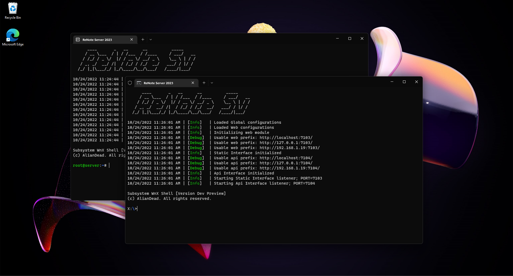

<h1 align="center">
  <b>ReNote</b>
  <br>
  <sub><sup><b><i>Beyond limitations</i></b></sup></sub>
</h1>

<p align="center">
  ReNote brings you an easy-to-use timetable software, including all the tools you need to empower your productivity as a teacher or student.
  <br><br>
  
  <br><br>
</p>

# Build ReNote
Use the `cd` command to navigate to one of the following directories: `Client`, `Server` or `Server.Database.CLI`. 
Next run the command below for the corresponding platform.

### Windows
```bash
dotnet build --runtime win-x64
```

### Linux
```bash
dotnet build --runtime linux-x64
```

### macOS
```bash
dotnet build --runtime osx-x64
```

Important: macOS is **not** officialy supported for the `Server`, you may want to use Linux Server or Windows Server.

Notes:
   - You need the .NET SDK to run the commands above. Download <a href="https://aka.ms/netcore">here</a>.
   - You can add the `--self-contained` parameter to add necessary dependencies to the output folder.
   - You can also build for 32bit platforms by changing the suffix `-x64` to `-x86` (Windows only).
   - Same apply for arm64 platforms by changing the suffix to `-arm64`. 


# Features
### → Server
 - Full support for static websites & Vue.js
 - Integrated API server
 - Integrated socket server
 - Database system
 - Database editor
 
### → Client
 - Easy-to-use interface
 - Useful tools for productivity.

# Contribute
If you have suggestions, bugs or problems with ReNote, you can let us know via the <a href="https://discord.gg/Z2wh3CHusT">Discord server</a> or by creating an issue. You can also donate to our <a href="">patreon</a> (Not available yet).

# License
- ReNote is licensed under the <a href="LICENSE">MIT</a> License.
- Newtonsoft.Json is licensed under the <a href="https://github.com/JamesNK/Newtonsoft.Json/blob/master/LICENSE.md">MIT</a> License.
- ProtoBuf is licensed under the <a href="https://github.com/protocolbuffers/protobuf/blob/main/LICENSE">BSD</a> License.
- ProtoBuf.NET is licensed under the <a href="https://github.com/protobuf-net/protobuf-net/blob/main/Licence.txt">Apache</a> License.
